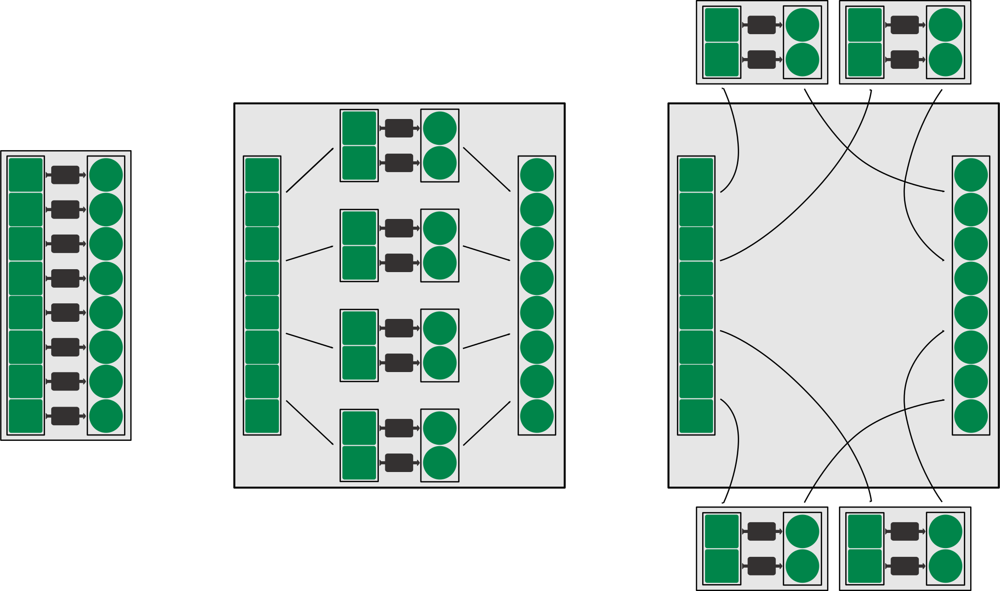

Unified Map
###########

.. image:: https://img.shields.io/badge/Python-3-00864b.svg
   :target: https://docs.python.org/3
   :alt: Python 3 |

.. image:: https://img.shields.io/badge/Release-v1.0.0-00864b.svg
   :target: https://pypi.org/project/unified-map/1.0.0
   :alt: Release v1.0.0 |

.. image:: https://img.shields.io/badge/Licence-Apache%202.0-00864b.svg
   :target: https://www.apache.org/licenses/LICENSE-2.0
   :alt: License Apache 2.0

Unified
    *Many implementations, one way of access.*
Map
    *Apply a function to a list of arguments and collect the results
    -- serial, parallel or distributed.*

Purpose
=======

This package provides reasonably simple syntax for a frequent programming task
which is implemented in various places (built-in, standard library, external libraries).
Here are three descriptions of this task:

- `Map <https://en.wikipedia.org/wiki/Map_(higher-order_function)>`_
  a list of inputs to a list of results via a user-provided function.
- `Apply <https://pandas.pydata.org/pandas-docs/stable/generated/pandas.Series.apply.html>`_
  a given function to a list of arguments to get a list of return values in the same order.
- `A black-box function <https://en.wikipedia.org/wiki/Black_box>`_
  is evaluated with different inputs and the outputs are collected.

In general, this is a so-called
`"pleasingly parallel problem" <https://en.wikipedia.org/wiki/Embarrassingly_parallel>`_
(aka "embarrassingly parallel" or "pleasingly parallel")
because it is straightforward to separate it into independend subtasks.
For this reason, and due to its frequent occurrence, it is recognized as a
`programming idiom <https://en.wikipedia.org/wiki/Map_(parallel_pattern)>`_
("parallel map", "parallel for loop")
in **parallel computing** that can equally simple be applied in **distributed computing**.
This package allows to do so with a focus on simplicity of use.

Use cases
=========

The function can be **univariate** (=takes one argument) or
**multivariate** (=takes several arguments).

|

The evaluation can be executed in a **serial** (=on one core), **parallel** (=on several cores)
or **distributed** (=on several machines) way.

|

.. note::
    The arrows indicate that **parallel** and **distributed** calculations send *objects*
    to other processes or machines, namely the *elements of the input list*, the *function*
    and the *elements of the result list*.
    This implies that all of these **objects need to be serializable**,
    which is not always the case:

    - If a library uses Python's `pickle module <https://docs.python.org/3/library/pickle.html>`_
      for object serialization, then only `certain objects
      <https://docs.python.org/3/library/pickle.html#what-can-be-pickled-and-unpickled>`_
      can be "pickled", i.e. be transformed in a binary serialization format.
      For example, a
      `lambda expression <https://docs.python.org/3/tutorial/controlflow.html#lambda-expressions>`_
      will not work as function, since it can not be pickled.
    - Some libraries use improved serialization functionality from elsewhere, e.g.
      `dill <https://github.com/uqfoundation/dill>`_ or
      `cloudpickle <https://github.com/cloudpipe/cloudpickle>`_.
    - Some libraries implement their own advanced serialization routines, e.g.
      `joblib <https://pythonhosted.org/joblib/persistence.html>`_ or
      `dask <http://distributed.readthedocs.io/en/latest/serialization.html>`_.

Installation
============

- **Complete installation** = with all optional dependencies

  .. code-block:: bash

     $ pip install "unified-map[complete]"

  .. note::
     *Apache Spark* installation currently can not be automated correctly.
     If you want to use it, please install it manually as described below.

- **Minimal installation** = with no optional dependencies

  .. code-block:: bash

     $ pip install unified-map

  | Functions that rely on third-party libraries will not work.
     You can, however, install any optional dependency you want to use by yourself, see below.

- **Optional dependencies**

  - `Joblib installation <https://pythonhosted.org/joblib/installing.html>`_

    .. code-block:: bash

       $ pip install joblib

  - `Dask installation <http://dask.pydata.org/en/latest/install.html>`_

    .. code-block:: bash

       $ pip install "dask[complete]"

  - `Apache Spark installation <https://spark.apache.org/docs/latest/index.html#downloading>`_

    Apache Spark is written in Scala and provides APIs for several languages (incl. Python).

    - There is a `"Python packaged version of Spark"
      available on PyPI <https://pypi.org/project/pyspark>`_
      that could be installed with :code:`pip`. This does, however, not include
      the necessary scripts (e.g. for starting workers),
      therefore manual installation is required.

    - The `"pre-packaged Apache Spark" needs to be
      downloaded from here <http://spark.apache.org/downloads.html>`_.
      Extract it in a desired place in your file system (e.g. :code:`$HOME/bin/spark`).
      Then certain environment variables need to be set (e.g. in :code:`.bashrc`)
      so that Apache Spark can be found in the shell and in Python.
      Most importantly, :code:`SPARK_HOME` needs to point at the installation directory:

      .. code-block:: bash

         export SPARK_HOME="$HOME/bin/spark/spark-2.3.0-bin-hadoop2.7/"
         export PATH="$SPARK_HOME/bin/:$PATH"
         export PYTHONPATH="$SPARK_HOME/python/:$PYTHONPATH"
    
    - Apache Spark uses `Py4J <https://www.py4j.org>`_
      to access Java objects from a Python interpreter:
    
      .. code-block:: bash

         $ pip install py4j

    - Apache Spark is written in Scala which runs on a Java Virtual Machine,
      hence it may be necessary to install or update
      Java on your machine. The documentation indicates that :code:`Java 8+`
      is required.

      - On a Linux system you can check your Java version on the command line
        with :code:`java -version`.
      - An `open-source implementations like OpenJDK <http://openjdk.java.net/>`_
        may work (no guarantee!).
      - If necessary, install the
        `official Java Runtime Environment (JRE) from Oracle
        <http://www.oracle.com/technetwork/java/javase/downloads/index.html>`_.

.. _quickstart:

Quickstart
==========

Univariate function applied to a list of arguments where each element is a single value

.. literalinclude:: code/quickstart_univariate.py

Multivariate function applied ot a list of arguments where each element is a tuple of values

.. literalinclude:: code/quickstart_multivariate.py

.. note::
   :code:`connect_to_scheduler(<address>)` requires that a scheduler and workers
   were started in other processes, possibly running on remote machines,
   see :ref:`cluster-setup`.

   Start a scheduler in one terminal:

   .. code-block:: bash

      $ python3
      >>> import unified_map as umap
      >>> umap.cluster_setup.dask.start_scheduler('10.0.0.5:8789')

   Start workers in other terminals:

   .. code-block:: bash

      $ python3
      >>> import unified_map as umap
      >>> umap.cluster_setup.dask.start_worker('10.0.0.5:8789')

More detailed information
=========================

.. toctree::
   :maxdepth: 1

   rst/api/api
   rst/references
